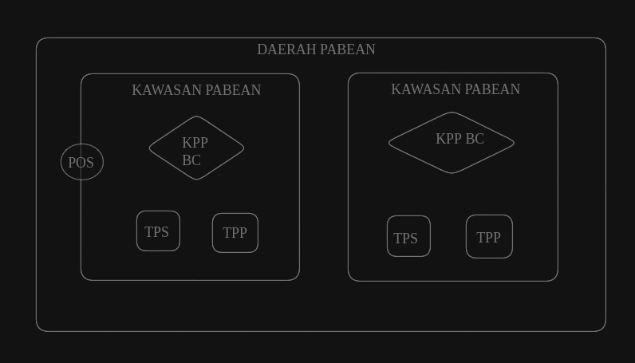

# TERMINOLOGI KEPABEANAN

## Kepabeanan

Kepabeanan adalah aktivitas **pengawasan** dan **pemungutan pajak** atas barang yang masuk/keluar ke daerah pabean.

Tidak semua negara menggabungkan proses pengawasan dan pemungutan pajak atas suatu barang, namun di Indonesia dua tugas itu digabung menjadi satu dan dilaksanakan oleh petugas BC (Bea Cukai).

Proses pengawasan dan pemungutan pajak penting untuk ketahanan sebuah negara. Baik itu dari sisi ekonomi, pertahanan, lingkungan hidup dsb.

## Daerah Paben

Daerah pabean adalah seluruh wilayah **NKRI** ditambah beberapa tempat di **ZEE** (Zona Ekonomi Ekslusif) dan **landas kontinen**.

| NKRI                | ZEE       | Landasan Kontinen |
| ------------------- | --------- | ----------------- |
| 12 Mil + 24 Mil     | 200 Mil   | 300 Mil           |
| 19.31 Km + 38.62 Km | 321.87 Km | 563.27 Km         |

Yang dimaksud tempat tertentu adalah tempat dimana adanya kegiatan **eksplorasi**.

Suatu barang yang memasuki daerah pabean, secara otomatis berlaku seluruh Undang-Undang kepabeanan yang diawasi oleh petugas BC.

## Kawasan Pabean

Kawasan pabean adalah kawasan yang peruntukkan untuk arus **lalu lintas** barang. Tujuannya agar lebih mudah dalam melakukan pengawasan maka semua barang dikonsentrasi disatu tempat.

Biasanya kawasan pabean ada di **pelabuhan** atau **bandara**.

Tidak boleh melakukan **pengolahan** barang dalam kawasan.

Semua barang impor harus dibongkar di dalam kawasan pabean. Melakukan pembongkaran selain di kawasan pabean adalah tindakan **pidana**.

Untuk kondisi teknis tertentu misalnya, barang terlalu besar. Proses pembongkaran bisa dilakukan di luar kawasan pabean dengan **izin** Kepala Kantor BC.

## Kawasan Bebas (Free Trade Zone)

Kawasan berikat adalah sebuah kawasan yang berisi kegiatan produksi barang yang tujuannya untuk diekspor.

Di kawasan FTZ seluruh barang masuk **tidak dikenai pajak**. Karena pemerintah sengaja memberikan perlakuan khusus agar kawasan tersebut bisa **tumbuh** ekonominya.

Kawasan Bebas yang berada di wilayah Indonesia terdapat di **Batam, Sabang, Bintan dan Karimun**.

Perbedaan antara FTZ dan Kawasan Berikat

| FTZ                 | ZEE                 |
| ------------------- | ------------------- |
| Pembebasan Pajak    | Penangguhan Pajak   |
| Boleh ada pemukiman | Tidak diperbolehkan |

FTA adalah hasil dari **Konvensi Kyoto**.

Untuk proses perizinan, di Kawasan Bebas biasanya selain API (Angka Pengenal Impor) juga dibutuhkan izin dari **Dewan Kawasan**.

## Tempat Penimbunan

Barang impor, sementara menunggu pengeluarannya dari kawasan pabean ditimbun di tempat penimbunan **(TPS)**.

Dalam kasus tertentu **(misal: peralatan tidak memadai)** bisa saja sebuah barang ditimbun di tempat lain.

Bentuk dari TPS bisa berupa **lapangan** (untuk barang FCL), bisa juga berupa **hanggar** (LCL/barang curah).

TPP (Tempat Penimbunan Pabean) adalah tempat ketika barang yang ditimbun di TPS telah lewat batas waktunya **(dihitung dari tanggal BC 1.1)**.

Batas waktu barang di TPS adalah **30 hari kalender**. Apabila barang belum juga dikeluarkan maka barang akan dipindah dari TPS ke TPP. Status barang dipindah akan berubah menjadi **barang tidak dikuasai**.

## Tempat Penimbunan Berikat

Tempat Penimbunan Berikat adalah tempat penimbunan barang yang akan diolah dan hasilnya diekspor kembali.

Barang yang ditimbun akan ditangguhkan pajaknya sampai barang tersebut akan diekspor atau dipakai.

Tempat Penimbunan Berikat adalah perluasan dari TPS.

Pada kawasan berikat, kegiatan meliputi: impor untuk dipakai, diekspor kembali, diolah, dipamerkan, dijual, dilelang dan didaur ulang.

Tempat penimbunan berikat bisa berupa: Kawasan berikat, gudang berikat, pusat logistik berikat, toko bebas bea, kawasan daur ulang berikat, tempat lelang berikat, dan tempat penyelenggaraan pameran berikat.

## Kantor Pabean

Kantor pabean adalah tempat **pemenuhan** kewajiban pabean. Oleh karenaya **tidak semua** kantor yang ada petugas pabean masuk kualifikasi sebagai kantor pabean.

Kegiatan pemenuhan kewajiban pabean meliputi dua hal: **penyerahan PIB dan pelunasan pungutan atas barang**.

## Pos Pengawasan Pabean

Pos pengawasan pabean adalah tempat yang digunakan petugas BC untuk melakukan **pengawasan**.

Pada pos pengawasan tidak ada aktivitas **pemenuhan** kewajiban pabean. Hanya melakukan pengawasan saja.

Proses pemenuhan kewajiban dilakukan di kantor pabean.

[lihat juga](https://chatgpt.com/share/e226700c-5231-4565-b860-351a00f3a393)

